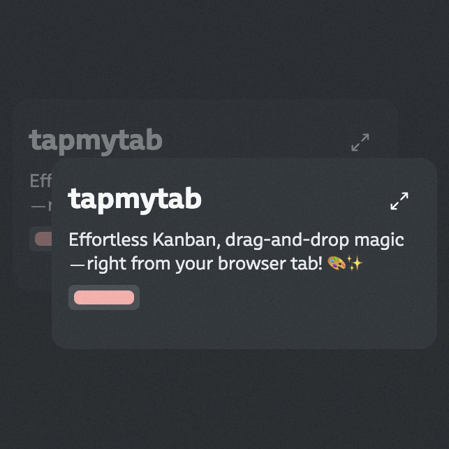

<div align="center">



# tapmytab: Effortless Kanban, drag-and-drop magic—right from your browser tab! 🎨✨
[krehwell](https://krehwell.com) 👾, [Hafizh Izzan Zaldi](https://www.linkedin.com/in/hafizh-izzan-zaldi/) 👩🏻‍🎨🖌
</div>


## ✨ Features
- 🌟 Open Source 
- ✏️ Scratch anything on your new tab
- 📋 Instant Kanban board appears on every new Chrome tab
- 🎯 Drag-and-drop (DND) functionality for smooth task management
- 📝 Full Markdown support for rich text formatting in cards
- 🔄 Auto-sync across all Chrome tabs
- 🔒 Local storage for data privacy and offline access
- ⚡ Quick-add edit tasks
- 🏷️ Custom labels and tags for better organization
- ⌨️ Markdown shortcuts for faster formatting
- 📁 Multiple board support for different projects
- 💾 Export/Import functionality for backup (_maybe coming_)
- 📊 Progress tracking with visual indicators (_maybe coming_)
- 🎨 Customizable board themes and layouts (_maybe coming_)

## 📦 Installation 

We love Deno and you should too
```
cd ./tapmytab
deno install --allow-scripts
deno task dev
```

## ⚡️ Getting the dev extension to work locally

1. The `deno task dev` script will generate a `dist/` dir which you can load it to the chrome extension. [See
   Instruction](https://developer.chrome.com/docs/extensions/get-started/tutorial/hello-world?authuser=1#load-unpacked)

2. If you have load unpacked the `dist/` into your `chrome://extensions/` now you can open a new tab and override the
   tab with the dev extension. Any changes will trigger the hot-reload


### 🚢 Build & Publish

```
deno task build
zip -r tapmytab dist/
```

Now you can publish it to chrome webstore dev console. [See Instruction](https://chrome.google.com/webstore/devconsole)

