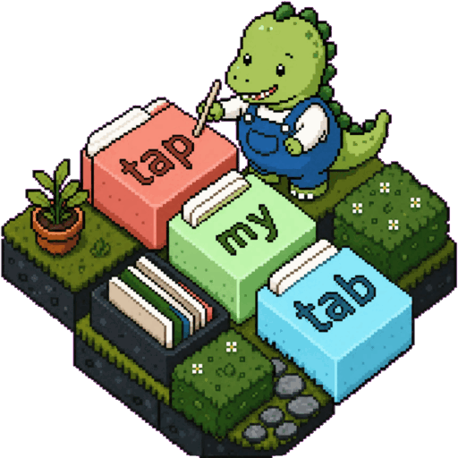

<div align="center">



# tapmytab

Effortless Kanban, drag-and-drop magic right from your browser tab! 🎨✨

[krehwell](https://krehwell.com) 👾 · [Hafizh Izzan Zaldi](https://www.linkedin.com/in/hafizh-izzan-zaldi/) 👩🏻‍🎨🖌 · [**Download**](https://chromewebstore.google.com/detail/tapmytab/djfcjmnpjgalklhjilkfngplignmfkim?authuser=0&hl=en) 🚀

</div>

<p align="center">
  
</p>

## ✨ Features

-  ✏️ Capture ideas instantly:  jot down notes, brain dumps, links, or quick sketches the moment they come up.
-  📋 Plan with a built-in Kanban board:  create boards, organize cards, and keep work moving in one place.
-  🎯 Drag, drop, and reorder freely:  move cards across columns and boards with zero friction.
-  🎨 Sketch ideas visually:  draw diagrams, flows, and rough concepts when text is not enough.
-  📝 Write your way:  full Markdown and rich-text support for clean notes, detailed cards, and better formatting.
-  🔎 Searchable tasks:  find all tasks easily with fuzzy search tool built-in
-  🏷️ Stay organized:  use custom tags, filters, and due dates to find what matters and keep deadlines visible.
-  🔄 Sync across tabs:  changes made in one tab appear everywhere else instantly.
-  💾 Keep your data portable:  export or import boards whenever you want to back up, move, or archive them.
-  🔒 Fully local and private:  your data stays on your device. No cloud account, tracking, or internet connection required.
-  🪶 Tiny and lightweight:  ~2 MB, no unnecessary bloat.
-  ♾️ No artificial limits:  create as many boards and cards as you need, stored locally.
-  🌟 Open Source:  if you think it's a feature?
-  🦊 Works across browsers:  available on Chrome & Firefox

## 📦 Installation

We love Deno and you should too

```
cd ./tapmytab
deno install --allow-scripts
deno task dev
```

## ⚡️ Getting the dev extension to work locally

1. The `deno task dev` script will generate a `dist/` dir which you can load it to the chrome extension. [See Instruction](https://developer.chrome.com/docs/extensions/get-started/tutorial/hello-world?authuser=1#load-unpacked)

2. If you have load unpacked the `dist/` into your `chrome://extensions/` now you can open a new tab and override the
   tab with the dev extension. Any changes will trigger the hot-reload

or simply run `localhost:5173` if you're lazy (_cards won't persist though_)

### 🚢 Build & Publish

Bump the version first on: `deno.json`, `manifest.json`, and `manifest.firefox.json` then

```bash
# build for chrome & firefox
deno task zip 
```

**Chrome Web Store**: upload `tapmytab-chrome.zip` at [chrome developer dashboard](https://chrome.google.com/webstore/devconsole) 

**Firefox Add-ons**: upload `tapmytab-firefox.zip` at [addons.mozilla.org/developers](https://addons.mozilla.org/developers/) 

> Note: the Firefox build swaps in `manifest.firefox.json` after the Chrome build, so always produce the Firefox zip with `zip:firefox` (not by hand) to get the right manifest.
